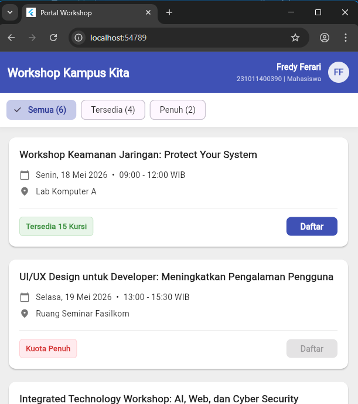

# Jawaban Nomor 2

---

### 1. Sketsa Layout
Dalam menyusun tampilan ini, saya membagi layar menjadi tiga bagian utama agar tetap rapih, yaitu:

*   **Header (AppBar)** : Saya mendesain bagian atas yang profesional dengan memisahkan antara nama aplikasi "Workshop Kampus Kita" di sisi kiri, dan identitas user (Nama, NIM, serta status Mahasiswa) di sisi kanan dekat foto profil.
*   **Filter Bar**: Tepat di bawah header, saya menyediakan baris tombol pilihan (ChoiceChip) untuk memfilter daftar workshop berdasarkan status kuotanya. hal ini bertujuan agar menyaring kuota workshop yang sudah penuh dan yang masih tersedia
*   **Daftar Workshop** : Konten utama yang saya buat menggunakan kartu-kartu workshop yang disusun secara vertikal dari atas ke bawah menggunakan ListView. Di dalam setiap kartu, informasi disusun menggunakan kombinasi baris dan kolom. pada kartu tersebut sudah dibedakan mana judul, jadwal, jam, dan lokasi

---

### 2. Alasan Pemilihan Widget
Beberapa widget utama saya pilih dengan pertimbangan fungsi dan efisiensi:

*   **ListView.builder** : Saya memilih ini karena jumlah workshop ada 6 dan bisa bertambah. Widget ini jauh lebih efisien daripada Column biasa untuk menghindari error overflow dan memastikan halaman bisa di-scroll dengan lancar.
*   **Card** : Widget ini sangat membantu untuk mengelompokkan informasi per satu acara workshop. Efek bayangan (elevation) pada kartu membantu memisahkan satu data dengan data lainnya secara visual.
*   **ChoiceChip** : Saya menggunakan ini untuk fitur filter karena tampilannya modern dan tidak memakan banyak ruang, namun sangat membantu user dalam mencari workshop yang masih tersedia.
*   **Row & Column** : Kombinasi ini saya gunakan untuk mengatur tata letak informasi. Column untuk urutan baca atas-bawah, sedangkan Row untuk menyejajarkan ikon dengan teks (seperti menggabungkan info tanggal dan jam dalam satu baris) agar lebih hemat tempat.

---

### 3. 2 Kesalahan UI yang Ingin Dihindari
*   **Information Overload (Terlalu Penuh)** : Menampilkan terlalu banyak teks label tanpa jeda. Solusinya, saya mengganti label seperti "Lokasi:" dan "jadwal" dengan ikon visual dan menambahkan fitur filter agar user tidak pusing melihat semua data sekaligus.
*   **Kontras yang Buruk** : Menggunakan warna background dan kartu yang sama (misalnya sama-sama putih antara background dan card) sehingga batas antar konten tidak terlihat. Solusinya, saya menggunakan background abu-abu terang agar kartu putihnya terlihat lebih menonjol.

---

### 4. Penjelasan Kenyamanan Baca (UX)
Fokus utama saya adalah membuat tampilan yang mudah dipahami tanpa harus membaca teks secara detail :

*   **Hierarki Visual** : Saya membuat judul workshop dengan ukuran lebih besar dan dicetak tebal (bold) agar menjadi titik fokus utama oleh pandangan user.
*   **Penggunaan Ikon** : Daripada menuliskan instruksi yang panjang, saya menggunakan ikon kalender, jam, dan lokasi. sebab otak manusia lebih cepat memproses simbol daripada teks, sehingga beban kognitif user berkurang.
*   **Whitespace & Spacing** : Saya memberikan jarak yang cukup (padding) antar kartu dan elemen di dalamnya. Ruang kosong ini penting agar informasi tidak terlihat menumpuk dan user merasa nyaman saat melakukan browsing jadwal workshop.

### Preview Aplikasi

